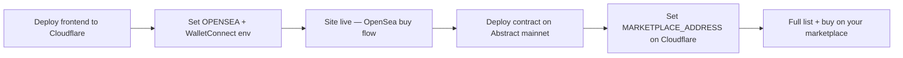

# Deployment Options

Two separate deployments: the **smart contract** (Abstract chain) and the **web app** (Cloudflare Workers).

---

## Can the agent deploy the contract for you?

**Not to mainnet without your wallet.** Deploying `NameMarketplace.sol` requires:

- Your **private key** (or a hardware wallet / deploy script you run locally)
- **ETH on Abstract** for gas (~$1–5 typically, varies with network)

I will not ask for your private key in chat or store it in the repo. That must stay on your machine or in a secure secret manager you control.

### What I *can* do

| Action | Who |
|--------|-----|
| Compile the contract | ✅ Already done — `contracts/` builds with Foundry |
| Dry-run / simulate deploy | ✅ You or I can run without `--broadcast` |
| Deploy to **Abstract mainnet** | ❌ **You** — one command with your key |
| Deploy to **Abstract testnet** | ⚠️ Practice only — real Gigaverse names are on mainnet |
| Wire contract address into the app | ✅ Set `NEXT_PUBLIC_MARKETPLACE_ADDRESS` after you deploy |
| Deploy frontend to Cloudflare | ✅ You run `npm run cf:deploy` after Cloudflare login |

---

## Option 1 — Deploy contract yourself (recommended)

**Best for:** Production marketplace with real Gigaverse name NFTs.

### Prerequisites

1. [Foundry](https://book.getfoundry.sh/getting-started/installation) installed
2. Wallet with ETH on **Abstract mainnet** ([bridge](https://portal.abs.xyz/bridge))
3. Abscan API key (optional, for verification): [abscan.org](https://abscan.org)

### Commands

```bash
cd contracts
forge build

# Simulate first (no gas spent)
export PRIVATE_KEY="0xYOUR_KEY"
export FEE_RECIPIENT="0xYOUR_WALLET"   # receives 2.5% platform fees
./deploy.sh

# When simulation looks good, broadcast for real:
./deploy.sh --broadcast

# Optional: verify on Abscan
./deploy.sh --broadcast \
  --verify \
  --verifier-url https://api.abscan.org/api \
  --etherscan-api-key YOUR_ABSCAN_KEY
```

Copy the deployed address from the output, then in the project root:

```bash
# .env.local
NEXT_PUBLIC_MARKETPLACE_ADDRESS=0xYourDeployedAddress
```

Restart the app. **Sell** and **Buy** on your marketplace will work.

Full details: [DEPLOYMENT.md](./DEPLOYMENT.md)

---

## Option 2 — Testnet practice deploy

**Best for:** Learning Foundry / testing the deploy script only.

| | Mainnet | Testnet |
|---|---------|---------|
| Chain ID | `2741` | `11124` |
| RPC | `https://api.mainnet.abs.xyz` | `https://api.testnet.abs.xyz` |
| GigaNameNFT | `0x57E8…9259` (real names) | Different — **not** real names |
| Faucet | Bridge ETH | [Alchemy faucet](https://www.alchemy.com/faucets/abstract-testnet) |

```bash
cd contracts
export PRIVATE_KEY="0x..."
export ABSTRACT_RPC=https://api.testnet.abs.xyz
./deploy.sh --broadcast
```

Listings on testnet won't interact with real Gigaverse names until you deploy on **mainnet**.

---

## Option 3 — Skip custom contract (OpenSea only)

**Best for:** Launching the UI quickly without on-chain escrow.

- Leave `NEXT_PUBLIC_MARKETPLACE_ADDRESS` **unset**
- Browse, search, and **Buy on OpenSea** still work
- **Sell** page directs users to OpenSea

You can deploy the contract later and add the address without rewriting the app.

---

## Option 4 — Deploy frontend to Cloudflare

**Best for:** Global edge hosting, Git-based deploys, custom domain.

This repo is scaffolded for [@opennextjs/cloudflare](https://opennext.js.org/cloudflare).

### One-time setup

1. [Cloudflare account](https://dash.cloudflare.com/sign-up) (Workers **Paid** plan recommended — free tier has a 3 MiB Worker size limit; this app is larger gzipped)
2. Install deps (already in `package.json` after scaffold):
   ```bash
   npm install
   ```
3. Log in to Wrangler:
   ```bash
   npx wrangler login
   ```

### Environment variables on Cloudflare

Set these in the Cloudflare dashboard (**Workers → your worker → Settings → Variables**) or in `wrangler.jsonc` / `.dev.vars` for local preview:

| Variable | Secret? | Purpose |
|----------|---------|---------|
| `OPENSEA_API_KEY` | ✅ Yes | Server API routes (`/api/names`, etc.) |
| `NEXT_PUBLIC_WALLETCONNECT_PROJECT_ID` | No | Wallet connect ([cloud.walletconnect.com](https://cloud.walletconnect.com)) |
| `NEXT_PUBLIC_MARKETPLACE_ADDRESS` | No | Your deployed contract (after Option 1) |

### Deploy commands

```bash
# Local preview in Workers runtime
npm run cf:preview

# Deploy to *.workers.dev (or your custom domain)
npm run cf:deploy
```

### GitHub auto-deploy (optional)

1. Cloudflare dashboard → **Workers & Pages** → **Create** → connect `parse-nip/glhf-name-sales`
2. Build command: `npm run cf:deploy`
3. Add secrets `OPENSEA_API_KEY` in the dashboard

### Custom domain

After first deploy, attach a domain in Cloudflare dashboard → **Workers** → **Triggers** → **Custom Domains** (e.g. `names.yourdomain.com`).

---

## Recommended order



1. **Cloudflare first** — get the UI live (OpenSea integration works immediately)
2. **Contract second** — deploy when you're ready to own the listing flow
3. **Add contract address** to Cloudflare env vars — no redeploy of contract needed

---

## Cost rough guide

| Item | Typical cost |
|------|----------------|
| Abstract contract deploy | Small amount of ETH (gas) |
| Cloudflare Workers Paid | ~$5/mo (check current pricing) |
| OpenSea API | Free tier available |
| WalletConnect | Free tier available |
| Domain | Optional, ~$10/yr if you use one |

---

## Security checklist

- [ ] Never commit `PRIVATE_KEY`, `.env.local`, or `.dev.vars`
- [ ] Use a dedicated deployer wallet, not your main holdings wallet
- [ ] Set `FEE_RECIPIENT` to a wallet you control (or multisig later)
- [ ] Mark `OPENSEA_API_KEY` as **encrypted** in Cloudflare dashboard
- [ ] Verify contract on Abscan after mainnet deploy
